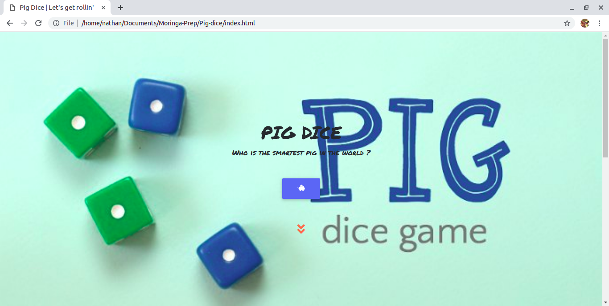
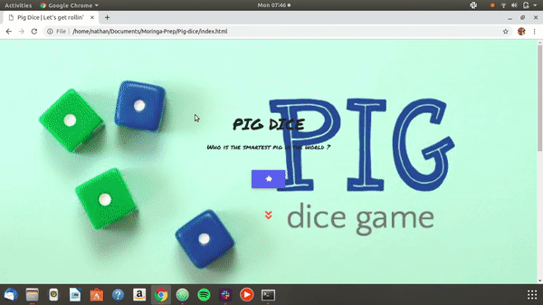

# Pig-Dice Game

#### A fun dice-rolling game.

#### By **Nathan Ng'ethe**

## Description
Pig-dice is a deeply engrossing game whereby the player rolls a dice and continues rolling until he/she decides to hold the aggregate score, or the dice lands on a one and the player's entire score is nullified. Hope you enjoy playing the game.

## Features
* Rules - the player is supposed to read this before starting the game so as to understand the game-flow. However, if you need to clarify on some rules while in the middle of your game you can click the help icon at the top right of the game page.

* Roll & Hold buttons - use these to roll the dice until you get to a desired mark whereby you can hold the die and the score is added to your total score.

* New Game - use this icon to reset the game if you wish to start all over again.

## Demo

## Setup instructions
The game is only available for online access but in the future I plan to have it available for offline access.

## Technologies used
- [HTML & CSS]() - I used html to make the backbone of the game and CSS to style various elements inthe HTML document.
- [Bootstrap]() - This acts as a framework especiallly when it comes to positioning elements in the game.
- [Javascript]() - Javascript is the main component when it comes to the game's functionality. I also used [jQuery]() as a library.

## Behaviour Driven Development (BDD)
| Project should handle : | Input example :     | Output example : |
| :------------- | :------------- | :-------------         |
| Access to the game       | Click the pig       | Game page opens    |
| Rolling the die       | Click 'roll' button 3 times      | 2, 2, 3    |
| Holding the die       | Click 'hold' button       | Score : 7    |
| Showing rules of the game       | Click 'help' icon       | Pop up with a list of the instructions appears    |
| Starting a new game       | Click 'new game' icon       | Game page appears with reset fields    |

## Known bugs
So far, there are no known bugs in the game. However, if you find any you are free to contact me through my contacts listed below.

## Contact information
To contact me, you can reach out to me via gmail at ngethenan768@gmail.com or call me on +254 706446072.

## License
The work is under an [MIT License](https://github.com/lendilai/Pig-dice/blob/master/LICENSE). (c) [Nathan Ng'ethe](https://github.com/lendilai)
